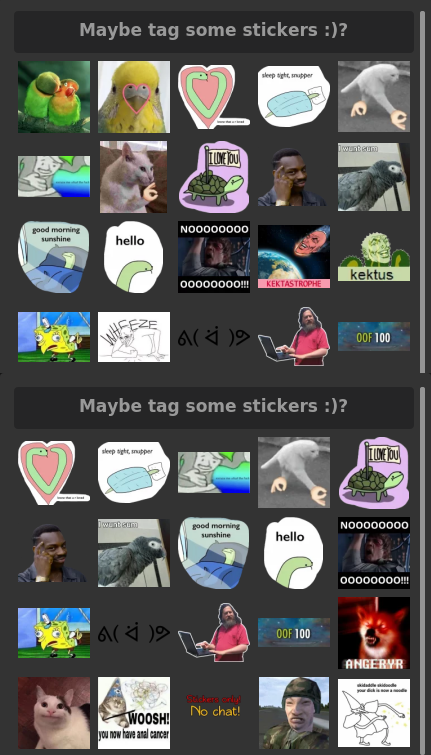
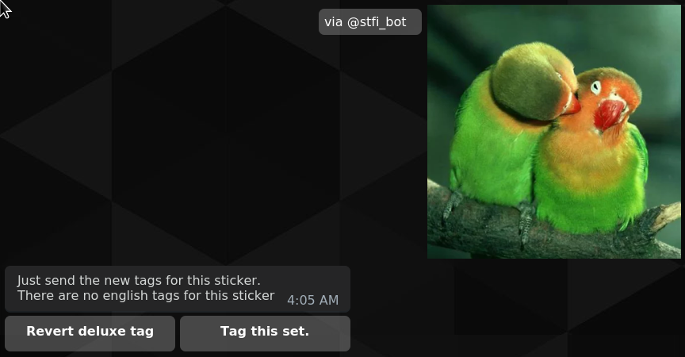
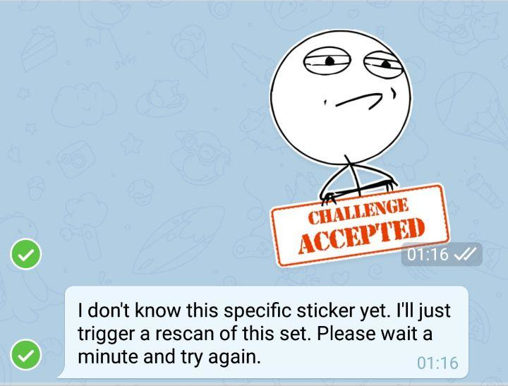

+++
title = "The mystery of Telegram's changing file ids"
summary = "A debugging story about weird behavior of one of my bots, data loss, and telegram's peculiarities."
date = 2019-08-15

# If the section variable `sort_by` is set to `weight`, then any page that lacks a `weight` will not be rendered.
weight = 0

# A draft page will not be present in prev/next pagination
draft = false

# If filled, it will use that slug instead of the filename to make up the URL
slug = "the-mystery-of-changing-telegram-file-ids"

# Whether the page should be in the search index.
in_search_index = true

# Template to use to render this page
template = "page.html"

[taxonomies]
tags = ["python", "telegram", "chatbot", "sticker", "sticker-finder", "bug-hunting"]
categories = ["Bug hunting"]

[extra]
+++


One evening, when I was just texting my SO good night, I noticed something terrible.
My favorite telegram bird stickers were no longer at the top of my suggested sticker list!

Since you probably don't know my projects yet, here some background info.
I wrote a telegram sticker bot to easily find and manage stickers in 2018 named [Sticker Finder](https://github.com/nukesor/sticker-finder) ([@stfi_bot](https://t.me/stfi_bot)).
By 2019 it was finished, polished, feature-rich and working like a charm.

Among those features are:

- Search of stickers with tags and emojis (like @gif). This is the main functionality
- Custom tags that can be added by any user
- Favorites (This is the important one for now)
- Lots of other stuff including maintenance/admin tools
- At the time of writing there are 308k stickers and 5800 sticker sets.


Anyhow, back to the topic of missing bird stickers.
Well, I use those bird stickers really often, and they should actually be on top of the list, but somehow they were missing.
This could only mean that something went terribly wrong...

<p style="flex flex-row" align="center">
    
</p>

At this point of time, I was quite confused.
It was about 2am in the middle of the night, the bot has been running for months without any serious bugs and everything was perfect. 
There was a slow and steady stream of new users and people occasionally added new tags.
How could this happen?

First thing I did, was to check the tags of one of the stickers that were no longer in my favorite list.
As it turned out this sticker did not just vanish from my favorites, all tags of the sticker were gone as well!



I couldn't believe my eyes at first and checked the database:

```
stickerfinder> select su.sticker_file_id, su.created_at, su.usage_count from sticker_usage as su 
..............     join sticker as s ON s.file_id = su.sticker_file_id 
..............     join sticker_set as ss on ss.name = s.sticker_set_name 
.............. where ss.name = 'bribstuff';
+----------------------------------+----------------------------+---------------+
| sticker_file_id                  | created_at                 | usage_count   |
|----------------------------------+----------------------------+---------------|
| CAADAgADagEAAuE14wi8kneF2_GsQxYE | 2019-08-08 02:14:03.913729 | 1             |
+----------------------------------+----------------------------+---------------+
```

That's when I went full panic mode. This couldn't be, I've used this pack more than a hundred times: **I was losing data!**

My first thought was that there was somehow a wrong delete statement for sticker sets, which resulted in everything being deleted through foreign key cascades.
However this wasn't the case. The creation date of the sticker set was still in 2018 and everything was fine.

```
stickerfinder> select created_at from sticker_set
    where name = 'bribstuff'
+----------------------------+
| created_at                 |
|----------------------------|
| 2018-09-24 21:09:16.133315 |
+----------------------------+
```

Anyway, I wanted to be sure and looked at every single `session.query.delete(` statement in the project, with the result that this couldn't be the source of the problem.

And here I was going back to being even more confused, since I couldn't think of any reason for my stickers loosing their tags and usages.
Still, I continued to dig around and kept looking att the database on the search for clues.

While investigating at the stickers again I noticed something quite odd.

```
stickerfinder> select s.file_id, s.created_at from sticker as s 
..............     join sticker_set as ss on ss.name = s.sticker_set_name 
.............. where ss.name = 'bribstuff' limit 10;
+------------------------------------+----------------------------+
| file_id                            | created_at                 |
|------------------------------------+----------------------------|
| CAADAgAD2wEAAuE14wh0elyGVgLaCxYE   | 2019-08-07 06:49:07.515145 |
| CAADAgADbwEAAuE14wgE_EDrx6FGaRYE   | 2019-08-07 06:47:23.093684 |
| CAADAgADlwEAAuE14wh8txi-VXaKIhYE   | 2019-08-07 06:48:31.403097 |
| CAADAgADsgEAAuE14wh0SmPZLRvtnxYE   | 2019-08-07 06:47:56.325414 |
| CAADAgAD2QEAAuE14whjZgfjCuubxBYE   | 2019-08-07 06:49:04.720578 |
| CAADAgADXQEAAuE14wimPBqGcpeu4hYE   | 2019-08-07 06:46:42.504707 |
| CAADAgADaAEAAuE14wgg_pObwixjdBYE   | 2019-08-07 06:47:17.982294 |
| CAADAgADhAEAAuE14wh4VEd40qdQ6RYE   | 2019-08-07 06:47:51.579517 |
| CAADAgADvwEAAuE14wia7UTzyi1s1RYE   | 2019-08-07 06:48:28.283723 |
| CAADAgADZwEAAuE14wheifMAAVh_YhYWBA | 2019-08-07 06:47:16.579703 |
+------------------------------------+----------------------------+
```

We are getting closer. The sticker set hasn't been deleted, but it looks like the stickers have been created only a day ago.

Somehow my memory kicked in and I remembered a weird behavior I noticed about a week ago, while I was tagging some stickers in the metro.
At the time I didn't think much of it and shrugged it off as a random glitch (Don't ever do that, when it's your own project...).



Sticker Finder complained about not knowing a specific sticker of a set, even though it was definitely known beforehand!

A faint hunch crept into my mind, but... naaahh..., that couldn't be the case, why should they do something like this?
Just changing file ids without saying anything, they wouldn't do something like this, that would be weird.

Still, I wanted to be sure and dug out some old database dump in which everything was still fine.

A few lines of debugging debugging code later:

```
for sticker in sticker_set.stickers:
    tg_sticker = bot.get_file(sticker.file_id)
    if tg_sticker.file_id != sticker.file_id:
        print(f'Old id: {sticker.file_id}')
        print(f'New id: {sticker.file_id}')
```

```
Old id: CAADAgADagEAAuE14wi8kneF2_GsQwI
New id: CAADAgADagEAAuE14wi8kneF2_GsQxYE
```


Ok. Time for damage control and some explanations.

Sticker Finder uses Telegram's file ids as a primary key for stickers, since it's the only unique identifier I can work with.
Thereby this id is also used as a foreign key for usage statistics and the many-to-many table between tags and stickers.

In case Sticker Finder encounters a unknown sticker, whose set is known, it is assumed that this pack got new stickers and a rescan of the whole set is triggered.
This rescan method then replaces the old sticker collection of the sticker set with an up-to-date collection.

Luckily, I was a little bit more careful than usual when defining the relationships between sticker sets and stickers.
Instead of deleting all orphans of the collection, I only added an `ON DELETE CASCADE` to the relationship between the two, just in case.
Since the sticker set has never been deleted the only thing that changed was the reference of the sticker to the sticker set, which has been updated to `NULL`.

Because of this, it should also be easy to see how many stickers are affected by this bug.

```
stickerfinder> select count(*) from sticker
    where sticker_set_name is null;
+---------+
| count   |
|---------|
| 16768   |
+---------+
```

Holy shit! That's a lot... After looking at some timestamps, I discovered that this was going on for months already, without anyone noticing (or anyone reporting).

But as already mentioned, the old data was still there, it just needed to be merged with the new one.
Since calling the `bot.get_file()` function with the old file id would yield the new id, I now had a way to map my old data to the new one.

The code looks something like this:

```
# Sometimes file ids in telegram seem to randomly change
# If this has already happened, merge the two stickers (backup replay)
# otherwise, change the file id to the new one
for sticker in sticker_set.stickers:
    try:
        tg_sticker = bot.get_file(sticker.file_id)
    except BadRequest as e:
        if e.message == 'Wrong file id':
            session.delete(sticker)
        continue

    if tg_sticker.file_id != sticker.file_id:
        new_sticker = session.query(Sticker).get(tg_sticker.file_id)
        if new_sticker is not None:
            # In here all the merging happens and
            # the new sticker gets deleted
            merge_sticker(session, sticker, new_sticker)

        # Update the old sticker id to the new one
        sticker.file_id = tg_sticker.file_id
        session.commit()

```

After all, about three hours later, I managed to have minimal data loss. Didn't expect that.

I have absolutely no idea why the telegram devs are doing this.
I brought this topic up in a talk with a few other telegram bot devs and it turns out that several of them are having trouble with their bots because of this behavior.
Random changes of file ids seem not only to happen for stickers, but they rather happen for all files!

Anyway, I implemented a stable and reliable fix and everything should be back to normal.


Lessons learned:
- Never be too eager about deleting data and keeping a super clean database state. You might need those "unnecessary" bits of data.
- Trust your hunches
- It's not always you, who's the idiot


Arne Beer
